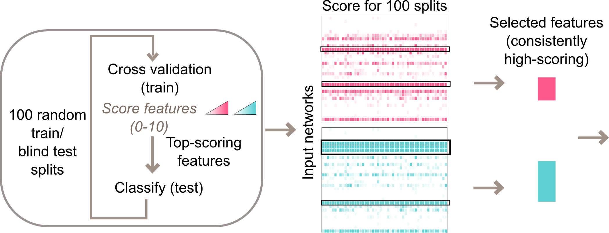

# Design the Predictor

## Nested cross-validation design

We recommend a nested cross-validation design for predictor building.
**Inner loop:** Patient samples are split (e.g. 80:20) into a training and a blind test set. Using only the training samples, 10-fold cross validation is performed for each class, generating for each network a score between 0 and 10. Networks that scored 9 or 10 out of 10 are used to classify blind test samples. Note that this loop also generates a performance score for this particular blind test sample.

**Outer loop:** The inner loop is repeated (e.g. 100 times), which each loop using a new random split of train and blind test (100 trials). 

The average of blind test classification across the 100 splits is used to measure overall predictor performance. 

Feature-selected networks are those that score consistently well across all the outer loops. For example, a strict criterion would require networks to score score 10 out of 10 in all loops.o

## Overall workflow

